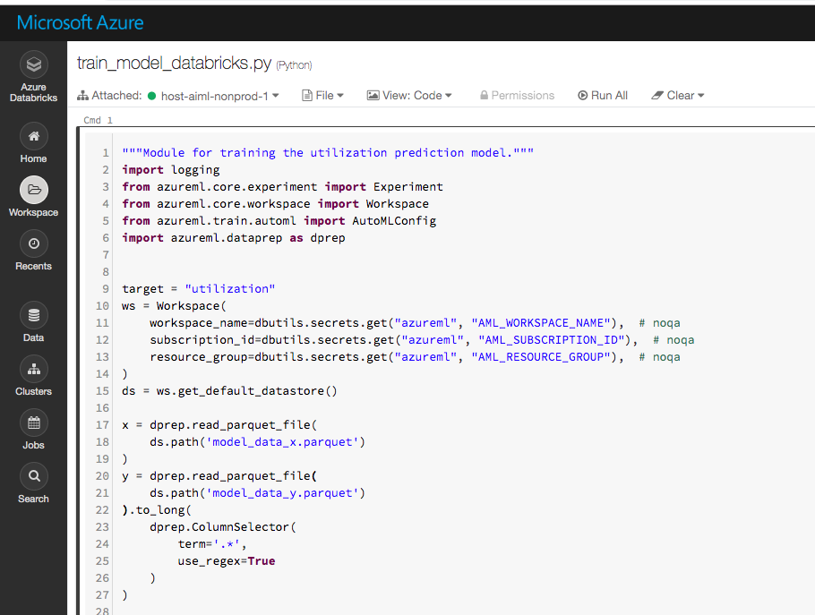
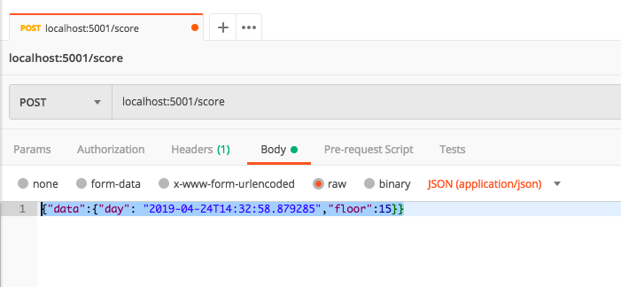
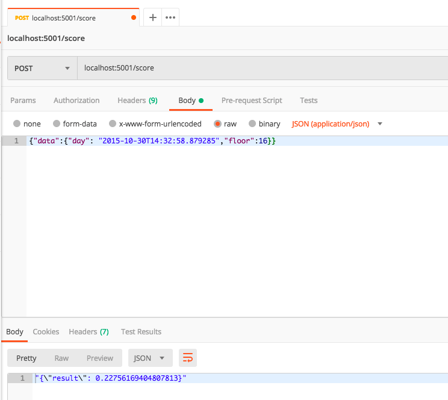

## CBRE Host ML - Meetup Presentation Code
### North Texas AI Meetup - April 24th, 2019

### Code

Prerequisites

* conda
* databricks cli
* git
* azure subscription
* azure databricks workspace
* azure machine learning service
* docker

Clone the repo
```bash
git clone https://github.com/cbre360/host-ml-nt-ai-meetup.git
```

Build the conda environment

```bash
conda env create -f environment.yml
```

Activate the environment

```bash
source activate host-ml-nt-ai-meetup
```

Get some data

```bash
get_data
```

Engineer some features

```bash
engineer_features
```

Run automl job locally to get a baseline model

```bash
train_model
```

Run automl job in databricks to run model training in parallel

```bash
make upload_to_databricks
```

Open the databricks workspace to the code we just uploaded



### *NOTE:*
For databricks to be able to authenticate to azureml, AML_WORKSPACE_NAME, AML_SUBSCRIPTION_ID, and AML_RESOURCE_GROUP secrets should be stored under the azureml scope. [info on secrets](https://docs.azuredatabricks.net/user-guide/secrets/index.html)

Create docker image to house the model

*NOTE:* with the model name printed above, update the .env and score.py to reflect the model name.

```bash
build_image
```

Run the container locally

```bash
make run_image_locally AML_CONTAINER_REGISTRY={AML_CONTAINER_REGISTRY_NAME}
```

Test the rest endpoint

#### With Curl
```bash
make test_endpoint
```

#### With Postman
* URL = localhost:5001/score
* METHOD = POST
* DATA = {"data":{"day": "2019-04-24T14:32:58.879285","floor":15}} (json)



## Success!
